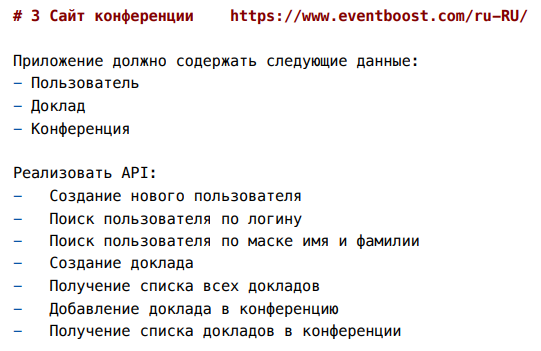
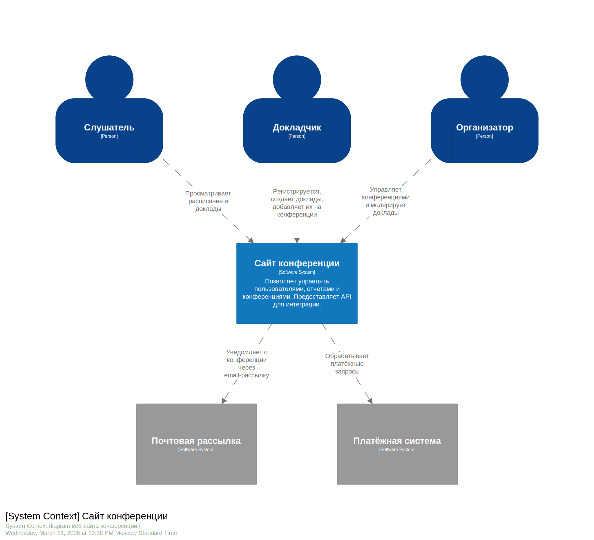
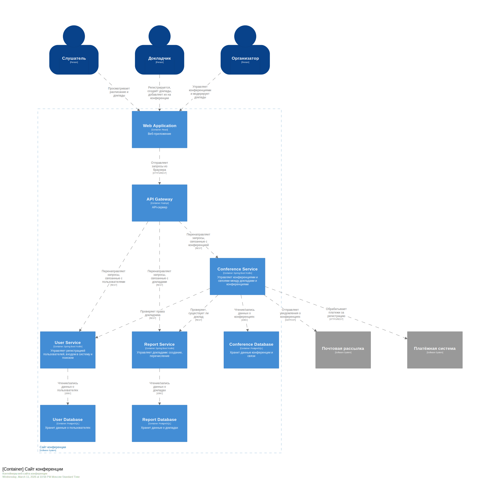
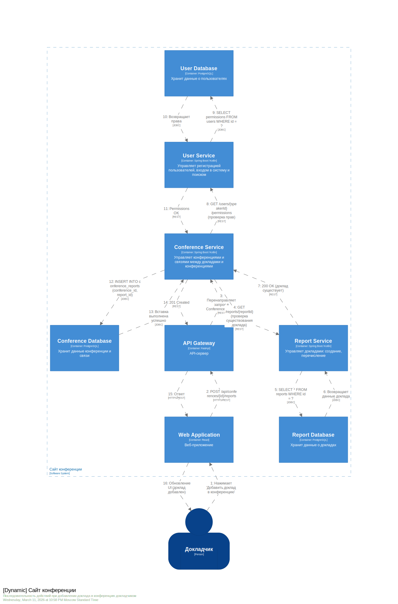

# Задание №1, вариант 3 (Сайт конференции)
**Выполнил**: *Злобин Владимир Олегович* \
**Группа**: *М8О-102СВ-21*

**ТЗ:**

# Решение

## 1) Роли пользователей
- **Слушатель** – неавторизованный или авторизованный пользователь, который просматривает информацию о конференциях и докладах.
- **Докладчик** – авторизованный пользователь, имеющий право создавать доклады и добавлять их в конференции.
- **Организатор** – авторизованный пользователь с расширенными правами: управляет конференциями, модерирует доклады и пользователей.

## 2) Внешние системы для интеграций
- **Почтовая рассылка** – отправка уведомлений о конференциях (например, напоминания, подтверждения).
- **Платёжная система** – обработка платежей за участие в конференциях (если требуется оплата).

## 3) Контекстная диаграмма (C1)
  

## 4) Use Cases

- **UC-1: Просмотр конференций и докладов**  
  *Актор:* Слушатель  
  *Описание:* Просмотр списка доступных конференций и докладов без авторизации.  
  *Приоритет:* Обязательный

- **UC-2: Регистрация пользователя**  
  *Актор:* Любое лицо → Слушатель/Докладчик  
  *Описание:* Создание учётной записи с указанием логина, имени, фамилии и роли (слушатель/докладчик).  
  *Приоритет:* Обязательный

- **UC-3: Поиск пользователя по логину**  
  *Актор:* Организатор, Докладчик  
  *Описание:* Поиск зарегистрированного пользователя по точному логину.  
  *Приоритет:* Обязательный

- **UC-4: Поиск пользователя по маске имени и фамилии**  
  *Актор:* Организатор, Докладчик  
  *Описание:* Поиск пользователей по частичному совпадению имени и/или фамилии.  
  *Приоритет:* Обязательный

- **UC-5: Создание доклада**  
  *Актор:* Докладчик  
  *Описание:* Создание нового доклада с указанием темы, описания и автора.  
  *Приоритет:* Обязательный

- **UC-6: Получение списка всех докладов**  
  *Актор:* Любой пользователь  
  *Описание:* Просмотр всех созданных докладов (возможно, с фильтрацией).  
  *Приоритет:* Обязательный

- **UC-7: Добавление доклада в конференцию**  
  *Актор:* Докладчик  
  *Описание:* Привязка существующего доклада к конкретной конференции (с проверкой прав докладчика и существования доклада).  
  *Приоритет:* Обязательный

- **UC-8: Получение списка докладов в конференции**  
  *Актор:* Любой пользователь  
  *Описание:* Просмотр всех докладов, включённых в выбранную конференцию.  
  *Приоритет:* Обязательный

- **UC-9: Управление конференциями**  
  *Актор:* Организатор  
  *Описание:* Создание, редактирование, удаление конференций.  
  *Приоритет:* Обязательный

- **UC-10: Отправка уведомлений о конференции**  
  *Актор:* Система (через внешний сервис рассылки) → Участники  
  *Описание:* Автоматическая отправка email-уведомлений о предстоящих конференциях или изменениях.  
  *Приоритет:* Обязательный

- **UC-11: Оплата участия в конференции**  
  *Актор:* Слушатель/Докладчик → Платёжная система  
  *Описание:* Проведение оплаты через внешнюю платёжную систему при регистрации на платную конференцию.  
  *Приоритет:* Обязательный

## 5) Диаграмма контейнеров (C2)
  

## 6) Контейнеры
- **Web Application (React)** – клиентское веб-приложение, через которое пользователи взаимодействуют с системой.
- **API Gateway (FastAPI / Yandex Userver)** – единая точка входа для запросов от веб-приложения, маршрутизирует их к соответствующим микросервисам.
- **User Service (Spring Boot / Kotlin)** – управление пользователями (регистрация, поиск, аутентификация).
- **Report Service (Spring Boot / Kotlin)** – управление докладами (создание, получение списка).
- **Conference Service (Spring Boot / Kotlin)** – управление конференциями и связями докладов с конференциями; также отвечает за взаимодействие с внешними сервисами (почта, платежи).
- **User Database (PostgreSQL)** – хранение данных пользователей.
- **Report Database (PostgreSQL)** – хранение данных докладов.
- **Conference Database (PostgreSQL)** – хранение данных о конференциях и связях с докладами.
- **Внешние системы:** Email Service (почтовая рассылка), Payment Service (платёжная система).

## 7) Dynamic-диаграмма
  
*Последовательность взаимодействия контейнеров при выполнении UC-7*

1. Докладчик нажимает кнопку "Добавить доклад в конференцию" в веб-приложении.
2. Веб-приложение отправляет POST-запрос к API Gateway.
3. API Gateway перенаправляет запрос в Conference Service.
4. Conference Service запрашивает у Report Service информацию о докладе (проверка существования).
5. Report Service обращается к Report Database для получения данных доклада.
6. База возвращает данные; Report Service подтверждает существование.
7. Conference Service запрашивает у User Service права докладчика.
8. User Service проверяет права в User Database и подтверждает.
9. Conference Service добавляет запись о связи доклада и конференции в Conference Database.
10. Conference Service возвращает успешный ответ API Gateway.
11. API Gateway передаёт ответ веб-приложению.
12. Веб-приложение обновляет интерфейс, сообщая об успехе.
